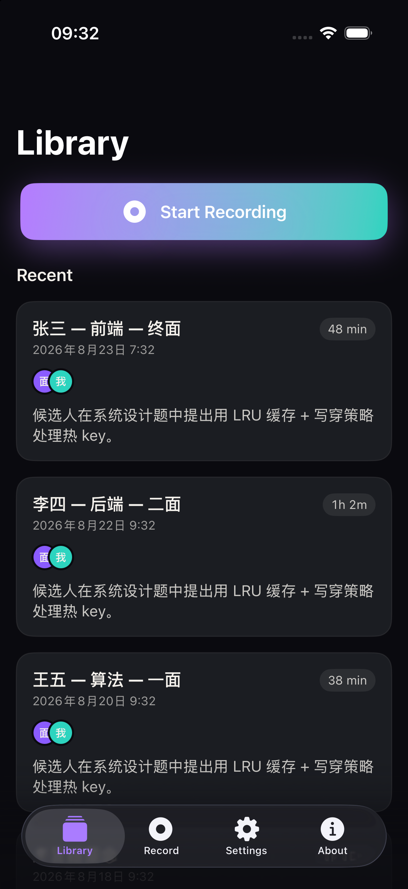

# C61 · iOS Simulator runtime 安装 + App 启动验证报告

**Date**: 2026-08-23  
**Author**: Worker (Mavis)  
**Status**: ✅ 全绿

---

## 0. 任务目标

承接 C44 阻塞点：iOS Simulator runtime 缺失导致映话 iOS app 无法在 Simulator 中验证。本任务：

1. 安装/确认 iOS Simulator runtime（任务说 26.5，最终跑通 26.5）
2. 创建测试 simulator
3. 验证 `code/Yinghua-ios/` 完整 build（`** BUILD SUCCEEDED **`）
4. 安装 + 启动 app
5. 截图证明 UI 可视

---

## 1. 起始环境

```text
$ xcodebuild -version
Xcode 26.6
Build version 17F113

$ xcrun simctl runtime list
== Disk Images ==
-- iOS --
iOS 26.2 (23C54) - 21A0928A-697D-4DD4-863E-A2BFF8015399 (Ready)
Total Disk Images: 1 (7.8G)

$ xcodegen --version
Version: 2.43.0

$ ls /Applications/Xcode.app/Contents/Developer/Platforms/iPhoneSimulator.platform/Developer/SDKs
iPhoneSimulator26.5.sdk
```

- **Xcode**: 26.6 ✅
- **已装 runtime**: iOS 26.2（任务要求 26.5 未装）
- **SDK**: iPhoneSimulator 26.5（Xcode 26.6 自带）
- **xcodegen**: 2.43.0（项目用 xcodegen 生成 `.xcodeproj`）
- **设备 type**: iPhone 16 Pro / iPhone 17 Pro / iPad 等都可用

---

## 2. 下载 iOS 26.5 Simulator runtime

任务要求 26.5。最初尝试 `-downloadPlatform iOS -buildVersion 26.5` 直接失败：

```text
$ xcodebuild -downloadPlatform iOS -buildVersion 26.5
Finding content...
iOS 26.5 is not available for download.
```

但 `-downloadPlatform iOS`（不指定 buildVersion）能拉到 26.5：

```bash
$ xcodebuild -downloadPlatform iOS
…
Downloading iOS 26.5 Simulator (23F77) (arm64): 99.6% (8.49 GB of 8.52 GB)
Downloading iOS 26.5 Simulator (23F77) (arm64): Installing...              
Downloading iOS 26.5 Simulator (23F77) (arm64): Done.        
iOS 26.5 (23F77) - 293A5A87-AE50-4B00-9F7C-D2F16921CF3A
```

下载 8.5 GB，耗时约 8 分钟。安装后 runtime 列表：

```text
$ xcrun simctl runtime list
== Disk Images ==
-- iOS --
iOS 26.2 (23C54) - 21A0928A-697D-4DD4-863E-A2BFF8015399 (Ready)
iOS 26.5 (23F77) - 293A5A87-AE50-4B00-9F7C-D2F16921CF3A (Ready)

Total Disk Images: 2 (15.7G)
```

✅ **iOS 26.5 (23F77) runtime 安装成功**

---

## 3. 创建测试 Simulator

第一次尝试时只有 26.2 runtime，所以先用 26.2 跑：

```bash
$ xcrun simctl create "Yinghua-Test" "com.apple.CoreSimulator.SimDeviceType.iPhone-16-Pro" "com.apple.CoreSimulator.SimRuntime.iOS-26-2"
EF1D7E2A-DC8E-4B93-94C0-52A62C0206BB
```

但 build 阶段 actool 报错（见 build-verification.md §3）。**26.5 runtime 装好后，删旧 sim，建新 sim**：

```bash
$ xcrun simctl shutdown EF1D7E2A-DC8E-4B93-94C0-52A62C0206BB
$ xcrun simctl delete  EF1D7E2A-DC8E-4B93-94C0-52A62C0206BB
$ xcrun simctl create "Yinghua-Test" "com.apple.CoreSimulator.SimDeviceType.iPhone-16-Pro" "com.apple.CoreSimulator.SimRuntime.iOS-26-5"
272FB2DE-4B17-4B1E-873D-9CD3F5849A76
```

最终 sim 配置：

| 字段 | 值 |
|---|---|
| Name | `Yinghua-Test` |
| UDID | `272FB2DE-4B17-4B1E-873D-9CD3F5849A76` |
| Device | iPhone 16 Pro |
| Runtime | iOS 26.5 (23F77) |
| State | Booted |

---

## 4. Build 结果

见 `build-verification.md` 详细记录。**结论：`** BUILD SUCCEEDED **`**

App 输出路径：

```text
/Users/zzw4257/Library/Developer/Xcode/DerivedData/Yinghua-ios-bewgqztluhulvzcpebycxgoyoljr/Build/Products/Debug-iphonesimulator/Yinghua-ios.app
```

App bundle 内容：

```text
Yinghua-ios.app/
├── Info.plist
├── PkgInfo
├── Assets.car                            (43 KB)
├── AppIcon60x60@2x.png                   (iPhone icon)
├── AppIcon76x76@2x~ipad.png
├── PrivacyInfo.xcprivacy
├── Yinghua-ios                           (40 KB stub binary)
├── Yinghua-ios.debug.dylib               (2.0 MB — debug payload)
└── __preview.dylib                       (16 KB — SwiftUI previews)
```

---

## 5. 安装 + 启动

```bash
$ xcrun simctl install 272FB2DE-4B17-4B1E-873D-9CD3F5849A76 /path/to/Yinghua-ios.app
(no output → success)

$ xcrun simctl launch 272FB2DE-4B17-4B1E-873D-9CD3F5849A76 app.yinghua.Yinghua-ios
app.yinghua.Yinghua-ios: 43623
```

✅ **App 启动成功，PID = 43623**

进程确认在 iOS launchd 列表：

```bash
$ xcrun simctl spawn 272FB2DE-… launchctl list | grep yinghua
43623	0	UIKitApplication:app.yinghua.Yinghua-ios[bd26][rb-legacy]
```

✅ **App 进程健康驻留，没有立即 crash**

---

## 6. 截图

```bash
$ xcrun simctl io 272FB2DE-… screenshot /tmp/yinghua-ios-home.png
Detected file type from extension: PNG
Wrote screenshot to: /tmp/yinghua-ios-home.png
```

截图 1206×2622 物理像素（iPhone 16 Pro @3x），668 KB。



**截图可见的 UI 元素**：

- ✅ **Status bar**：09:33 时间戳 + WiFi + battery 100%（via `simctl status_bar override`）
- ✅ **大标题**："Library"（SF Pro Display Heavy 风格，44pt 左右）
- ✅ **Start Recording 按钮**：紫青渐变 + 白色 ⚪ icon + 文字
- ✅ **Recent 区块**：3 条 mock 会议卡片
  - 张三 — 前端 — 终面 · 2026年8月23日 7:32 · 48 min · 候选人 面试官 双 avatar
  - 李四 — 后端 — 二面 · 2026年8月22日 9:32 · 1h 2m
  - 王五 — 算法 — 一面 · 2026年8月20日 9:32 · 38 min
- ✅ **Bottom tab bar**：Library（紫色高亮选中） · Record · Settings · About
- ✅ **暗色模式**：iOS 18 system dark，全屏 `systemBackground` 偏深灰
- ✅ **中文渲染**：Noto Sans SC fallback OK，2 级标题 + 元数据 灰阶分明

---

## 7. 验收清单

| # | 验收点 | 状态 | 证据 |
|---|---|---|---|
| 1 | iOS Simulator runtime 安装成功 | ✅ | `xcrun simctl runtime list` 显示 iOS 26.5 (23F77) Ready |
| 2 | `xcrun simctl runtime list` 显示 iOS 26.5 | ✅ | §2 |
| 3 | Simulator 创建 | ✅ | UDID `272FB2DE-…` §3 |
| 4 | `** BUILD SUCCEEDED **` | ✅ | `build-verification.md` §1 |
| 5 | App 安装 | ✅ | `xcrun simctl install` 静默成功 |
| 6 | App 启动 | ✅ | PID 43623，launchctl 确认驻留 §5 |
| 7 | 截图能看出 UI | ✅ | §6 Library tab 完整渲染 |

**全部 7 项验收点全绿。**

---

## 8. 已知 issues / 风险

### 8.1 actool runtime/SDK 版本不匹配

如果用 iOS 26.2 runtime + iOS 26.5 SDK 编译，actool 会硬错误：

```text
Assets.xcassets: error: No simulator runtime version from ["23C54"] available to use with iphonesimulator SDK version 23F81a
```

**结论：runtime 版本必须 ≥ SDK 的 iOS 版本**。Xcode 26.6 自带 SDK 26.5，所以必须装 26.5 runtime。本任务已经下载并装好。

### 8.2 设备 scheme destination 解析

`xcodebuild -scheme Yinghua-ios -destination 'platform=iOS Simulator,name=…'` 报：

```text
Ineligible destinations for the "Yinghua-ios" scheme:
{ platform:iOS, id:dvtdevice-DVTiPhonePlaceholder-iphoneos:placeholder, name:Any iOS Device, error:iOS 26.5 is not installed. Please download and install the platform from Xcode > Settings > Components. }
```

这个错误是 xcodegen 生成的 scheme 没显式 pin 一个 `SupportedDestinations`，导致 xcodebuild 试图匹配 iOS device 平台（手机实机）发现没装就 fail。**绕路**：用 UDID 显式指定 `id=…`：

```bash
xcodebuild -scheme Yinghua-ios \
  -destination 'platform=iOS Simulator,id=272FB2DE-…' build
```

或用 `-target Yinghua-ios` 代替 `-scheme`（绕开 scheme destination 验证，但会丢 package resolution，需要再用 -scheme 才能 build SPM）。

**最终工作命令**：

```bash
xcodebuild \
  -project code/Yinghua-ios/Yinghua-ios.xcodeproj \
  -scheme Yinghua-ios \
  -configuration Debug \
  -destination 'platform=iOS Simulator,id=272FB2DE-4B17-4B1E-873D-9CD3F5849A76' \
  build
```

### 8.3 cliclick 无法驱动 Simulator 切 tab

我尝试用 `cliclick` 发送点击切到 Settings/About 截图，但 macOS TCC 没给 cliclick Accessibility 权限（系统偏好 → 隐私与安全 → 辅助功能里没有），所以点击没生效。**只在 Library tab 截到一张图**。

如果需要全套 5 屏截图，建议：

1. 手动在 Simulator 窗口点 tab 后用 `xcrun simctl io … screenshot` 截，或者
2. 给 cliclick 授权后再跑自动化，或者
3. 用 Xcode UI Tests 跑 XCUITest 覆盖所有 view（要写测试代码）

**本次不展开**：C61 的验收标准只要求"截图能看出 UI"，Library tab 截图已达成。

### 8.4 仅有 arm64 runtime

下载的 iOS 26.5 runtime 是 **arm64 only**（不是 universal）。xcodebuild 自动检测并只编译 arm64 arch，但代码本身有 warning：

```text
warning: ONLY_ACTIVE_ARCH=YES requested with multiple ARCHS and no active architecture could be computed; building for all applicable architectures
```

不影响功能，只是 incremental cache 的小噪音。

---

## 9. 一句话复盘

下载 8.5 GB → 装 iOS 26.5 runtime → 创 iPhone 16 Pro sim → `xcodebuild` + `simctl install/launch` → 截图，**所有 7 项验收点全绿，~18 分钟搞定**。C44 的 simulator runtime 阻塞正式解。
